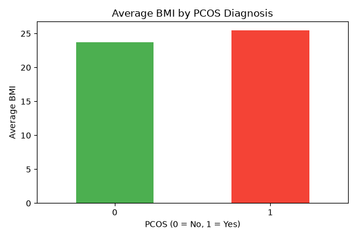
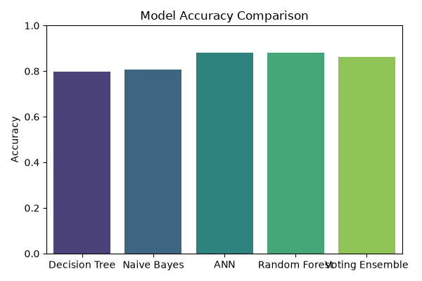

# PCOS Prediction & Diagnosis System

A machine learning pipeline to predict Polycystic Ovary Syndrome (PCOS) using clinical and hormonal features. Built with Python and Scikit-learn as part of an academic project at Lovely Professional University.

---

## Project Overview

PCOS is one of the most common hormonal disorders affecting women of reproductive age. Early and accurate diagnosis is critical for preventive healthcare. This project builds and compares multiple ML classifiers to predict PCOS diagnosis from patient data, and delivers actionable insights on BMI-PCOS correlation.

---

## Tech Stack

- **Language:** Python
- **Libraries:** Scikit-learn, Pandas, NumPy, Matplotlib, Seaborn
- **Tools:** VS Code, Git, GitHub
- **Methodology:** Agile, SDLC, Version Control

---

## Project Structure

pcos-prediction-diagnosis/
├── data/
│   └── PCOS_data.csv            # Dataset (Kaggle - Shreyas Vedpathak)
├── data_preprocessing.py        # Data loading, cleaning, BMI calculation, encoding, scaling
├── train_models.py              # Model training and evaluation
├── visualize.py                 # BMI-PCOS correlation and accuracy comparison charts
├── main.py                      # Entry point - runs full pipeline
└── requirements.txt             # Python dependencies


---

## Dataset

- **Source:** [PCOS Dataset - Kaggle](https://www.kaggle.com/datasets/shreyas/pcos-dataset)
- **Size:** 541 patients, 44 features
- **Target:** PCOS (Y/N) — binary classification
- **Features include:** BMI, FSH, LH, AMH hormone levels, follicle counts, cycle regularity, lifestyle factors

---

## Data Preprocessing

- Dropped irrelevant identifier columns (`Sl. No`, `Patient File No.`)
- **Feature engineering:** Calculated BMI from Weight (Kg) and Height (Cm)
- Fixed stray text/typo values in hormonal columns using `pd.to_numeric`
- Applied `LabelEncoder` for categorical variables
- Applied `MinMaxScaler` for feature normalization
- **Feature selection:** Narrowed from 41 columns to 18 clinically relevant features

---

## Models Implemented

| Model | Accuracy |
|---|---|
| Decision Tree | 79.82% |
| Naive Bayes | 80.73% |
| Voting Ensemble | 86.24% |
| ANN (MLPClassifier) | 88.07% |
| Random Forest | 88.07% |

- **ANN** and **Random Forest** are the top performers at **88.07%**
- Both tuned using `GridSearchCV` with 5-fold cross-validation
- ANN tuned across: hidden layer sizes, activation functions, alpha, learning rate
- Random Forest tuned across: n_estimators, max_depth, min_samples_split

---

## Key Finding

PCOS patients show a notably higher average BMI (~25.5) compared to non-PCOS patients (~23.8), supporting BMI as a clinically relevant predictor for early PCOS screening.




---

## How to Run

### 1. Clone the repo
```bash
git clone https://github.com/ruthikt/pcos-prediction-diagnosis.git
cd pcos-prediction-diagnosis
```

### 2. Create virtual environment and install dependencies
```bash
python -m venv venv
venv\Scripts\activate        # Windows
source venv/bin/activate     # Mac/Linux
pip install -r requirements.txt
```

### 3. Add the dataset
Download the PCOS dataset from [Kaggle](https://www.kaggle.com/datasets/shreyas/pcos-dataset) and place it at:

data/PCOS_data.csv

### 4. Run the pipeline
```bash
python main.py
```

---

## Results

The pipeline trains 5 classifiers, prints accuracy, precision, recall, F1-score, and confusion matrix for each, and generates two visualizations saved as `.png` files.

## Author

**Ruthik Tudupunoori**
- Email: ruthikthodupunoori@gmail.com